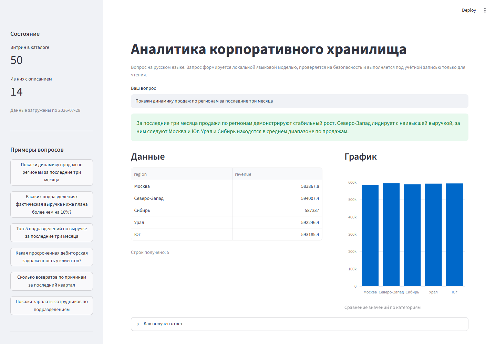
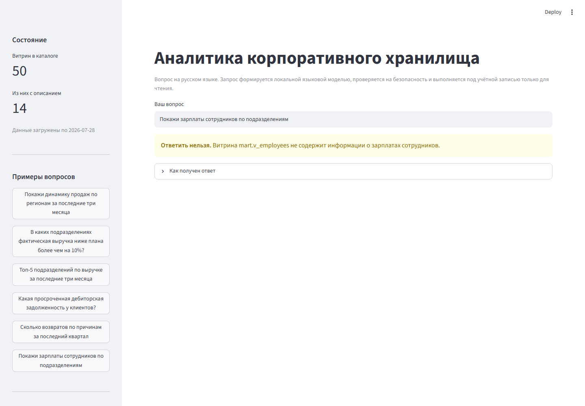
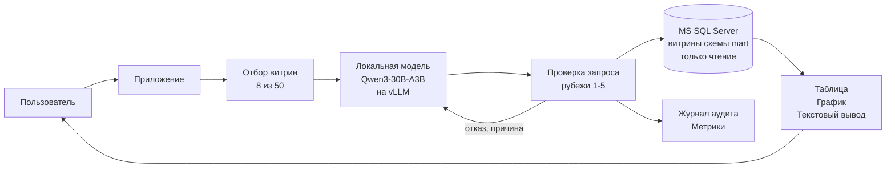

# DWH Copilot — аналитика корпоративного хранилища по вопросам на русском языке

[](https://github.com/devAsmodeus/dwh-copilot/actions/workflows/ci.yml)
[](LICENSE)
[](pyproject.toml)
[](sql/)
[](docs/architecture.md)

Пользователь задаёт вопрос на обычном русском языке. Система определяет смысл
вопроса, формирует запрос к хранилищу на Microsoft SQL Server, проверяет его
на безопасность, выполняет под учётной записью только для чтения и возвращает
текстовый вывод, таблицу и график.

Всё работает внутри корпоративного контура. Языковая модель размещена локально,
обращений к внешним службам нет, содержимое хранилища наружу не передаётся.

---

## Чем эта система отличается от обычного преобразования текста в SQL

Обычная схема — подать модели схему базы данных и попросить написать запрос —
даёт около половины верных ответов и не выдерживает промышленной эксплуатации.
Здесь применены три решения, меняющие результат.

**Модель не видит схему хранилища.** Она работает с семантическим слоем
из 50 представлений, внутри которых бизнес-логика уже закреплена человеком.
Вместо соединения четырёх таблиц модель пишет группировку по одной витрине.
Сложность перенесена туда, где она проверяема.

**Перечень разрешённых объектов не является кодом приложения.** Это система
прав СУБД. Ошибку в коде проверки допустить можно; запрет на базовые таблицы
на уровне СУБД обойти нельзя.

**Качество измеряется числом, а не мнением.** Набор из 25 бизнес-вопросов
с эталонными запросами прогоняется автоматически при каждом изменении текста
подсказки, манифеста витрин или версии модели. Снижение доли верных ответов
блокирует приём изменения.

---

## Быстрый запуск

Требуется Docker. Графический ускоритель для знакомства с системой не нужен:
интерфейс, проверки безопасности и стенд с данными работают без него.

```bash
git clone https://github.com/devAsmodeus/dwh-copilot.git
cd dwh-copilot
cp .env.example .env

docker compose up -d
```

Через две-три минуты интерфейс доступен по адресу http://localhost:8501.

Запуск вместе с сервером вывода модели (требует ускоритель и CUDA 12.8 и выше):

```bash
docker compose --profile llm up -d
```

### Запуск без видеокарты

Для ознакомления система работает на процессоре. Поведение не меняется, ответ
формируется за 30-60 секунд вместо 5.

```bash
docker compose --profile cpu up -d
docker exec dwh-ollama ollama pull qwen2.5-coder:7b
```

Если корпоративная сеть перехватывает защищённые соединения и контейнер
не может загрузить модель, используйте Ollama, установленную на самой машине:
она доверяет сертификатам из системного хранилища. В файле `.env` укажите
`DWH_LLM_BASE_URL=http://host.docker.internal:11434/v1`.

---

## Как это выглядит

Изображения сняты с работающей системы скриптом `scripts/capture_screenshots.py`,
а не нарисованы. Каждый вопрос проходит полный путь: отбор витрин, формирование
запроса языковой моделью, проверку безопасности, выполнение в СУБД, построение
графика и текстового вывода.



Система обязана уметь отказывать. Вопрос вне охвата разрешённых витрин приводит
к обоснованному отказу, а не к придуманному запросу:



Ход обработки раскрывается по требованию: какие витрины отобраны, какой запрос
выполнен, сколько потребовалось попыток. Это не отладочное средство, а требование
к системе: пользователь, принимающий решение по цифре, должен иметь возможность
проверить, откуда эта цифра взялась.


## Как это устроено



Подробная схема, обоснование выбора каждого компонента, размещение данных
по памяти и состав наблюдаемости: [docs/architecture.md](docs/architecture.md).

### Путь одного вопроса

| Шаг | Что происходит | Обращений к модели |
|---|---|---|
| 1 | Резолвер периодов: «последние три месяца» превращается в даты | нет, обычный код |
| 2 | Отбор 8 витрин и 4 примеров запросов по смысловой близости | нет, менее 50 мс на процессоре |
| 3 | Формирование запроса SQL | одно |
| 4 | Проверка безопасности, рубежи 1-4 | нет |
| 5 | Оценка стоимости выполнения, рубеж 5 | нет |
| 6 | Выполнение под учётной записью чтения, рубеж 6 | нет |
| 7 | Выбор вида графика по правилу | нет, обычный код |
| 8 | Формирование текстового вывода по таблице | одно |

При отказе на шагах 4-6 причина возвращается модели, и она исправляет запрос.
Число попыток ограничено двумя.

---

## Безопасность

Исходное допущение: **языковая модель считается недоверенным источником**.
Система спроектирована так, как если бы модель была полностью скомпрометирована.

Защита разделена на три независимых уровня, и обход одного не даёт обхода
остальных.

| Уровень | Рубежи |
|---|---|
| Генерация | Ограничение вывода грамматикой языка T-SQL на сервере vLLM |
| Приложение | Разбор в синтаксическое дерево, структурные правила, перечень разрешённых объектов, принудительное ограничение строк, оценка стоимости до выполнения |
| СУБД | Отдельная учётная запись, DENY на базовые таблицы, ограничение времени, отдельный пул ресурсов |

Попытки подменить инструкции через текст вопроса не фильтруются на входе.
Вместо этого система построена так, что успешная подмена ничего не даёт:
запрос к закрытой схеме не пройдёт проверку, а если бы прошёл, у учётной записи
нет прав на эту схему.

Подробно: [SECURITY.md](SECURITY.md).

### Что отсекается на проверке

```sql
SELECT * FROM mart.v_sales; DROP TABLE dbo.orders     -- несколько инструкций
SELECT * FROM [СЕРВЕР].[база].[dbo].[sysusers]        -- обращение к другому серверу
SELECT * FROM mart.v_sales
WHERE region = (SELECT TOP 1 name FROM sys.databases) -- системный каталог в подзапросе
SELECT a.*, b.* FROM mart.v_sales a, mart.v_clients b -- декартово произведение
SELECT * FROM mart.v_sales                            -- слишком дорого, рубеж 5
```

Последние два запроса законны с точки зрения синтаксиса и прав: объекты верные,
перечень разрешённых объектов пройден. Они отсекаются оценкой стоимости
выполнения, а не разбором текста.

---

## Измерение качества

Правильность определяется совпадением данных, а не сравнением текстов запросов.
Эталонный и полученный запрос выполняются на одном зафиксированном наборе
данных, после чего сравниваются таблицы. Запрос, написанный иначе, но дающий
те же данные, засчитывается как верный.

```bash
python -m dwh_copilot.eval_runner --check-only     # целостность набора, без модели и СУБД
python -m dwh_copilot.eval_runner --min-accuracy 0.70
```

| Величина | Что показывает | Целевое значение |
|---|---|---|
| Доля верных ответов | Совпадение данных с эталоном | не ниже 70 процентов |
| Запросы без повторов | Прошли проверку с первой попытки | не ниже 85 процентов |
| Среднее число повторов | Качество текста подсказки | не выше 0,3 |
| Время ответа, 95-й процентиль | Худший случай, который запоминает пользователь | не выше 20 секунд |
| Полнота отказов | Доля вопросов вне охвата витрин, на которые система отказалась отвечать | не ниже 90 процентов |

Последняя величина недооценивается чаще прочих. Система, которая не отказывается
никогда, придумывает ответы. Система, которая отказывается всегда, бесполезна.
Три вопроса из 25 в наборе заведомо неотвечаемы, и отказ на них засчитывается
как **правильный** ответ.

Состав набора: [eval/questions.yaml](eval/questions.yaml).

---

## Состав репозитория

```
src/dwh_copilot/
    catalog.py         каталог витрин, отбор под вопрос
    examples.py        банк примеров "вопрос и эталонный запрос"
    prompts.py         сборка подсказки: постоянная и переменная части
    llm.py             обращение к серверу вывода
    sql_validator.py   рубежи защиты 1-4
    db.py              выполнение запросов, оценка стоимости
    charts.py          выбор вида графика по правилу
    pipeline.py        конвейер обработки вопроса
    eval_runner.py     прогон набора бизнес-вопросов
config/
    views.yaml         манифест 50 витрин, семантический слой
    examples.yaml      банк примеров запросов
eval/
    questions.yaml     25 бизнес-вопросов с эталонами
sql/
    01_schema.sql      базовые таблицы и демонстрационные данные
    02_views.sql       витрины схемы mart
    03_security.sql    права доступа и самопроверка настройки
web/app.py             веб-интерфейс
tests/                 модульные проверки
```

---

## Требования к оборудованию

Система рассчитана на один сервер в корпоративном контуре.

| Компонент | Конфигурация |
|---|---|
| Ускоритель | RTX 5090, 32 ГБ. Архитектура Blackwell, требуется CUDA 12.8 и выше |
| Процессор | AMD EPYC 9124 |
| Оперативная память | 128 ГБ |
| Накопитель | NVMe 1,92 ТБ |

Расчёт распределения памяти ускорителя и обоснование выбора модели:
[docs/architecture.md](docs/architecture.md).

Пользователей: до 20, одновременно активных 5-10.

---

## Разработка

```bash
pip install -e ".[dev]"

ruff check .
mypy
pytest
```

Правило, определяющее весь процесс: **текст подсказки для модели является
кодом**. Он хранится в системе контроля версий, проходит проверку изменений
и покрыт тестами наравне с исполняемым кодом.

Порядок внесения изменений: [CONTRIBUTING.md](CONTRIBUTING.md).

---

## Лицензия

[MIT](LICENSE). Автор: Кругликовский Павел Александрович.
