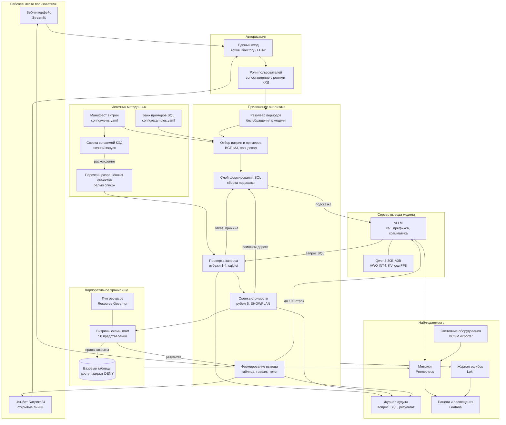
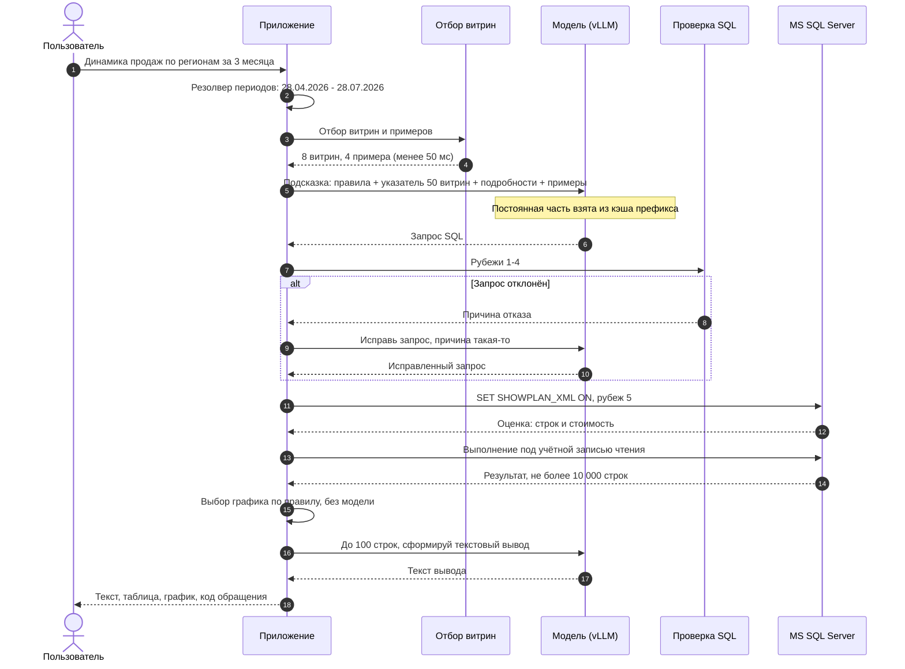

# Архитектура системы

## Общая схема

## Путь одного вопроса

## Обоснование выбора компонентов

### Языковая модель: Qwen3-30B-A3B

**Назначение.** Формирование запросов на языке T-SQL и текстовых выводов
по результатам.

**Почему выбрана.** Ключевое ограничение задачи заключается не в объёме памяти
ускорителя, а в её распределении. Доступно 32 гигабайта, и в них должны
поместиться и веса модели, и кэш контекста на 5-10 одновременных сессий.

| Модель | Веса INT4 | Кэш контекста, 10 сессий по 8 тысяч токенов | Итого |
|---|---|---|---|
| Qwen3-32B, плотная, кэш FP16 | около 19 ГБ | около 20 ГБ | около 39 ГБ, не помещается |
| Qwen3-32B, плотная, кэш FP8 | около 19 ГБ | около 10 ГБ | около 29 ГБ, впритык |
| **Qwen3-30B-A3B, разреженная, кэш FP8** | около 18 ГБ | около 8 ГБ | **около 26 ГБ, с запасом** |

Разреженная модель (mixture of experts, то есть смесь экспертов) содержит
30 миллиардов параметров, но на обработку каждого токена задействует
3,3 миллиарда. Это даёт качество уровня плотной модели на 32 миллиарда
при скорости уровня модели на 3 миллиарда. При 5-10 одновременных пользователях
на одном ускорителе это не оптимизация, а смена класса решения.

Лицензия Apache 2.0, что снимает вопросы юридического согласования
для внутрикорпоративного применения.

**Рассмотренные альтернативы.**

| Вариант | Причина отклонения |
|---|---|
| Gemma 3 27B | Лицензия Gemma Terms of Use содержит ограничения использования и не является лицензией, одобренной Open Source Initiative. Требует юридического согласования. Слабее в T-SQL |
| Llama 3.3 70B | Не помещается в 32 гигабайта даже при четырёхбитном квантовании |
| Qwen2.5-Coder-32B | Оставлена как запасной вариант. Проверенное качество на SQL, но плотная архитектура даёт меньшую пропускную способность |

**Порядок выбора.** Модель не выбирается по опубликованным сравнениям.
Три кандидата прогоняются на наборе из 25 бизнес-вопросов, выбор делается
по доле верных ответов, определяемой совпадением данных.

**Отмеченный риск.** RTX 5090 построена на архитектуре Blackwell
с вычислительной способностью 12.0. Ядра для четырёхбитных вычислений под эту
архитектуру появились в vLLM недавно. Проверка выполняется на стенде до начала
остальной разработки. Запасной вариант: формат FP8 поддерживается Blackwell
на аппаратном уровне, при отказе от INT4 применяется Qwen3-14B в FP8.

### Сервер вывода: vLLM

**Назначение.** Обслуживание обращений к модели.

**Почему выбран.** Четыре возможности, каждая из которых нужна по условиям
задачи.

1. **Кэширование префикса.** Постоянная часть подсказки, около 1500 токенов,
   одинакова для всех вопросов. Сервер сохраняет результат её обработки
   и переиспользует. При 10 пользователях это разница между ответом
   за 3 секунды и за 12.
2. **Ограничение вывода грамматикой.** Механизм xgrammar позволяет запретить
   формирование синтаксически неверного T-SQL на этапе генерации. Это рубеж 0
   защиты, получаемый без дополнительных затрат.
3. **Страничное управление памятью контекста.** Механизм PagedAttention
   позволяет разместить 10 сессий в оставшемся объёме памяти ускорителя.
4. **Выдача метрик.** Точка `/metrics` закрывает требование технического
   задания по мониторингу сервисов.

**Рассмотренные альтернативы.**

| Вариант | Причина отклонения |
|---|---|
| LM Studio | Настольное приложение с графическим интерфейсом. Нет точки выдачи метрик, нет полноценной контейнеризации, нет автоматического кэширования префикса, слабая пакетная обработка. Оставлено как средство локальных опытов |
| Ollama | Проще в развёртывании, но заметно ниже пропускная способность при одновременных обращениях, нет ограничения вывода грамматикой |
| SGLang | Сопоставим с vLLM по возможностям. Оставлен как равноценная замена |
| TensorRT-LLM | Наибольшая скорость, но сборка под каждую модель занимает часы и усложняет обновление |

### Слой формирования SQL: семантический слой

**Назначение.** Преобразование вопроса на русском языке в запрос к хранилищу.

**Главное решение.** Модель формирует запрос не по схеме хранилища, а по
семантическому слою из 50 представлений схемы mart. Бизнес-логика расчёта
показателей закреплена внутри представлений.

Три следствия, каждое из которых закрывает отдельное требование:

1. **Перечень разрешённых объектов перестаёт быть кодом приложения и становится
   системой прав СУБД.** Ошибку в коде проверки можно допустить; запрет DENY
   на базовые таблицы обойти нельзя.
2. **Определение показателя становится единственным.** Внутри представления
   уже записано, что выручка считается без налога на добавленную стоимость
   и за вычетом возвратов. Расхождение отчётов между собой невозможно
   по построению.
3. **Формируемые запросы становятся проще.** Локальная модель уверенно пишет
   группировку по одной витрине и заметно чаще ошибается в соединении четырёх
   таблиц. Сложность перенесена в SQL, написанный и проверенный человеком.

### Ответы на вопросы технического задания

**Нужно ли передавать модели всю схему хранилища.**

Нет. Модель работает с семантическим слоем, а не со схемой. При 50 витринах
их полные описания дают 10-12 тысяч токенов, и качество падает из-за большого
объёма нерелевантного текста. Описание подаётся в двух видах:

| Вид | Объём | Когда подаётся |
|---|---|---|
| Компактный указатель: имя и назначение по каждой из 50 витрин | около 900 токенов | Всегда, попадает в кэш префикса |
| Полное описание: колонки, типы, связи, примеры значений | около 1600 токенов | Только по 8 витринам, отобранным под вопрос |

Компактный указатель остаётся в подсказке намеренно: он даёт модели возможность
обнаружить существование подходящей витрины, подробности по которой в этот раз
не подавались, и сообщить об этом.

**Как работать, если в хранилище более 200 таблиц.**

Число базовых таблиц на архитектуру не влияет: модель их не видит. Растёт
не число таблиц, а число витрин. Схема отбора выдерживает рост до нескольких
сотен витрин без изменений, поскольку компактный указатель растёт линейно
и остаётся в пределах 3-4 тысяч токенов, а подробности подаются по фиксированному
числу отобранных витрин.

При выходе за эти пределы указатель делится по предметным областям, и отбор
становится двухступенчатым: сначала область, затем витрины внутри неё.

**Как обновлять метаданные при изменении схемы.**

Ночная сверка. Задание сравнивает состав колонок в `INFORMATION_SCHEMA`
с манифестом `config/views.yaml`. Расхождение порождает оповещение.
Несовместимое изменение приводит к автоматическому выводу витрины из перечня
разрешённых объектов до ручной вычитки.

Принцип: отказать лучше, чем молча выдать неверную цифру.

**Где хранить бизнес-словарь и примеры SQL.**

В системе контроля версий, как код. Манифесты в формате YAML лежат рядом
с определениями представлений, проходят проверку изменений и покрыты тестами.

Хранение в корпоративной вики отклонено: там нет обязательной проверки
изменений, и содержимое устаревает. Хранение в таблице базы данных отклонено
по той же причине: изменение эталонного примера не проходит рецензирование,
а ошибка в нём распространяется на все последующие ответы модели.

**Состав проверки SQL.**

Приведён в [SECURITY.md](../SECURITY.md).

## Размещение данных по памяти

| Носитель | Содержимое |
|---|---|
| Память ускорителя, 32 ГБ | Веса модели, около 18 ГБ. Кэш контекста активных сессий, около 8 ГБ. Кэш префикса подсказки, около 1500 токенов |
| Оперативная память, 128 ГБ | Приложение, векторный индекс описаний витрин, модель эмбеддингов BGE-M3, результаты выполненных запросов до передачи в интерфейс |
| Накопитель, 1,92 ТБ | Веса моделей, около 40 ГБ на две модели. Образы контейнеров. Журналы аудита и ошибок. Метрики. Резервные копии настроек |

**Загружаются ли данные хранилища в память ускорителя.** Нет. В модель
попадает только текст подсказки и не более ста строк результата для составления
текстового вывода. Содержимое хранилища в память ускорителя не помещается
ни при каких условиях.

**Какие результаты передаются модели.** Не более ста строк, и только на шаге
формирования текстового вывода. Полная таблица передаётся в интерфейс
пользователя, минуя модель.

**Как исключается передача модели миллионов строк.** Тремя независимыми
ограничениями:

1. Оценка стоимости до выполнения, рубеж 5: отказ при оценке свыше миллиона строк.
2. Принудительное ограничение TOP 10000, встраиваемое в запрос через
   синтаксическое дерево, рубеж 4.
3. Отсечение до ста строк перед передачей в модель.

**Как очищаются временные данные.** Результат запроса существует в оперативной
памяти в пределах обработки одного вопроса и освобождается сборщиком мусора
после отправки ответа. На диск результаты не записываются. В журнал аудита
попадают текст вопроса, текст запроса, число строк и время выполнения,
но не сами данные.

## Наблюдаемость

| Что наблюдается | Средство | Порог оповещения |
|---|---|---|
| Загрузка и температура ускорителя, занятая память | DCGM exporter | Память свыше 95 процентов, температура свыше 85 градусов |
| Процессор, оперативная память, накопитель | node exporter | Свободное место менее 15 процентов |
| Время ответа модели, глубина очереди, попадания в кэш префикса | точка `/metrics` сервера vLLM | 95-й процентиль времени ответа свыше 20 секунд |
| Доля отказов проверки запросов | метрики приложения | Свыше 30 процентов за час |
| Время выполнения запросов в СУБД | метрики приложения | 95-й процентиль свыше 10 секунд |
| Ошибки приложения | Loki | Появление ошибки уровня error |

Журнал аудита содержит по каждому обращению: код обращения, пользователя,
текст вопроса, отобранные витрины, все попытки формирования запроса с их
результатами, выполненный запрос, число строк, время. Хранение 180 дней.
